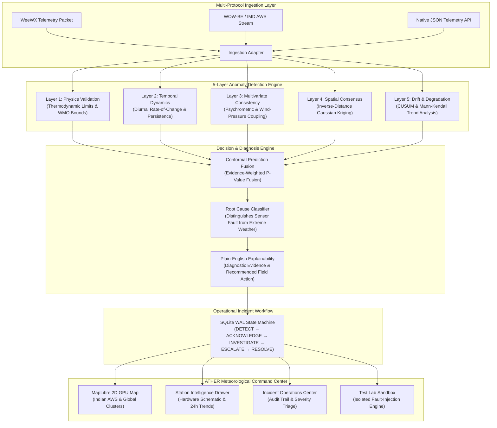

<div align="center">

# ⚡ ATHER
### Automated Telemetry Health & Environmental Reliability
**Multi-Layered Real-Time Anomaly Detection & Incident Diagnostics Engine for Meteorological AWS Networks**

[](https://python.org)
[](https://fastapi.tiangolo.com)
[](https://react.dev)
[](https://www.typescriptlang.org/)
[](https://maplibre.org/)
[](backend/tests)
[](LICENSE)

<br />

**[Key Features](#-key-features)** • **[System Architecture](#-system-architecture)** • **[5-Layer Engine](#-5-layer-diagnostic-engine)** • **[Command Center](#-command-center--ui-workspaces)** • **[Quick Start](#-quick-start)** • **[API Specs](#-rest-api-reference)**

---

</div>

## 📌 Executive Summary & Problem Statement

National meteorological agencies (such as the **India Meteorological Department (IMD)**) and environmental monitoring networks operate thousands of **Automatic Weather Stations (AWS)** deployed in unmonitored, harsh, and remote terrains. These stations continuously record surface air temperature, relative humidity, atmospheric pressure, wind velocity, and solar irradiance.

However, raw telemetry from AWS networks suffers from chronic reliability challenges:
- **Sensor Degradation & Drift**: Electrolytic capacitive hygrometers and PRT temperature sensors drift over months, injecting silent calibration biases.
- **Mechanical & Environmental Failures**: Bird nesting, solar radiation shield dirt accumulation (causing micro-greenhouse overheating), and frozen anemometer cups report false calm or stuck values.
- **The Confounding Dilemma (Anomaly vs. Extreme Weather)**: Traditional threshold algorithms falsely flag genuine, catastrophic meteorological events (cloudbursts, microbursts, dry squalls, sea-breeze fronts) as sensor defects because the rate of change is violent. Conversely, insidious sensor drift goes completely unnoticed because values hover within nominal climatological bounds.

### 💡 The ATHER Solution
**ATHER** is an end-to-end meteorological data integrity platform. Rather than treating telemetry as isolated numbers, ATHER treats each weather observation through an **evidence-based multi-tier diagnostic pipeline** combining:
1. **Thermodynamic physical limits** (WMO-No. 8 standards).
2. **Diurnal temporal kinematics** (rate-of-change and persistence monitoring).
3. **Multivariate psychrometric cross-consistency** (dew point vs. RH vs. wet-bulb equations).
4. **Spatial neighbor consensus kriging** (Gaussian spatial deviation against local AWS clusters).
5. **Statistical drift detection** (CUSUM & Mann-Kendall trend tests on running telemetry windows).
6. **Conformal Prediction Fusion**: Calibrated multi-evidence p-value fusion that assigns rigorous statistical confidence before escalating to field operators.

---

## 🏗️ System Architecture



---

## 🔬 5-Layer Diagnostic Engine

Every telemetry reading is evaluated concurrently across five distinct analytical layers before an anomaly score is synthesized:

| Layer | Scientific Methodology | What It Detects |
|:---|:---|:---|
| **Layer 1: Physics Validation** | Absolute thermodynamic limits derived from WMO-No. 8 standards; barometric lapse rates with elevation normalization; Clausius-Clapeyron vapor pressure bounds. | Impossible temperatures (>60°C or <-40°C), negative humidity, non-physical pressure drops, superheated dewpoints. |
| **Layer 2: Temporal Dynamics** | Rolling 1st and 2nd numerical derivatives ($\Delta x / \Delta t$); diurnal spline matching; flatline / frozen sensor detection ($Var(X_{\Delta t}) < \epsilon$). | Instantaneous sensor jumps (e.g. 7°C in 2 seconds), frozen ADC converters, erratic electrical spikes, transmission glitches. |
| **Layer 3: Multivariate Consistency** | Psychrometric consistency equations ($T \ge T_{\text{dew}}$); Magnus-Tetens vapor pressure formulation; wind gust-to-sustained speed ratios ($v_{\text{gust}} \ge v_{\text{sustained}}$). | Uncoupled sensor failures (e.g. 100% RH with 35°C temperature and falling pressure), broken hygrometers, mismatched sensor pairs. |
| **Layer 4: Spatial Consensus** | Inverse-Distance-Weighted (IDW) Gaussian spatial kriging; local Z-score calculation against the $k$-nearest active AWS stations ($d \le 50\text{km}$). | Station out-of-sync with immediate microclimate, localized rogue readings, micro-heat islands, uncalibrated station installation. |
| **Layer 5: Sensor Drift & Health** | Cumulative Sum (CUSUM) residual control charts; non-parametric Mann-Kendall monotonic trend tests; rolling calibration drift offsets. | Gradual calibration loss in thermistors, aging photodiodes, progressive dust accumulation on optical sensors. |

### 🎯 Conformal Evidence Fusion & Root Cause
Instead of simple linear score addition, ATHER utilizes **Conformal Prediction Sets**:
- Non-conformity scores from all 5 layers are transformed into calibrated empirical p-values.
- The engine identifies whether an event is an **Instrument Malfunction** (Physics/Multivariate layer triggers without Spatial corroboration) or a **True Extreme Weather Event** (Spatial and Multivariate layers agree across neighboring stations).
- An automated **Root Cause Classifier** tags the finding:
  - `PHYSICAL_IMPOSSIBILITY` • `SENSOR_STUCK_OR_FROZEN` • `CALIBRATION_DRIFT`
  - `ASPIRATION_SHIELD_FAILURE` • `ANEMOMETER_DEFECT` • `MICROCLIMATE_EXTREME`

---

## 🖥️ Command Center & UI Workspaces

The ATHER frontend is engineered with **React 19, TypeScript, and MapLibre GL**, providing a mission-critical dark-mode operational dashboard:

### 1. Interactive 2D Weather Command Center
- **GPU-Accelerated Clustering**: Smoothly handles 1,950+ worldwide and 296 Indian AWS stations at 60 FPS.
- **Multi-Source Basemaps**: Seamless switching between Dark Carto tiles and High-Resolution Satellite imagery.
- **Dynamic Weather Overlays**: Real-time scalar temperature grids and vector wind fields synthesized dynamically.
- **Filter Controls**: Quick toggles for Indian AWS networks, anomaly status (Normal, Warning, Anomaly), and sensor health.

### 2. Deep Station Intelligence Drawer
- **Hardware Architecture Visual**: Interactive diagram of an Automatic Weather Station showing component status (Ultrasonic Anemometer, Thermistor & Hygrometer Shield, Barometric Cavity, Pyranometer, Rain Gauge).
- **24-Hour Telemetry Sparklines & Charts**: Diurnal curves for temperature, humidity, pressure, and wind speed.
- **Diagnostic Breakdown**: Tabulated confidence, primary signal culprit, empirical layer scores, and plain-English meteorological explanation.

### 3. Persistent Incident Operations Center
- **Production State Machine**:
  $$\text{DETECT} \longrightarrow \text{ACKNOWLEDGE} \longrightarrow \text{INVESTIGATE} \longrightarrow \text{ESCALATE} \longrightarrow \text{RESOLVE}$$
- **Severity-Tiered Triage**: P1 Critical, P2 Major, P3 Minor, and P4 Info flags.
- **Full Audit Trail**: Timestamps and operator notes persisted to SQLite with Write-Ahead Logging (WAL) sidecars.

### 4. Isolated Test Lab Sandbox
- **Zero-Risk Simulation**: Runs scenarios through a sandboxed instance of the same production engine without polluting live telemetry.
- **Predefined Fault Injections**:
  - *Solar Radiation Overheating* (Aspiration motor failure simulation)
  - *Frozen Cup Anemometer* (Sub-zero freeze simulation)
  - *Severe Microburst Event* (True convective extreme weather verification)
  - *Gradual Thermistor Drift* (CUSUM calibration decay)
  - *Transmission Noise & Missing Packets*

---

## 🚀 Quick Start

### Prerequisites
- **Python**: 3.10 or higher
- **Node.js**: 18.0.0 or higher
- **Git**

### ⚡ One-Command Launch
Clone the repository and run the integrated launch script:
```bash
git clone https://github.com/gdhanushkumar07/ather-weather-anomaly-detection.git
cd ather-weather-anomaly-detection
chmod +x run_ather.sh
./run_ather.sh
```
The script will concurrently start:
- 🚀 **Backend API**: `http://localhost:8000` (Interactive API docs at `/docs`)
- 💻 **Frontend Web App**: `http://localhost:3000`

---

### 🛠️ Manual Step-by-Step Installation

#### 1. Backend Setup
```bash
# Navigate to backend directory
cd backend

# Create and activate virtual environment
python3 -m venv venv
source venv/bin/activate  # On Windows: venv\Scripts\activate

# Install dependencies
pip install -r requirements.txt

# Run backend service
python3 run.py
```

#### 2. Frontend Setup
```bash
# In a separate terminal, navigate to frontend
cd frontend

# Install Node dependencies
npm install

# Start Vite development server
npm run dev
```

---

## 🧪 Verification & Automated Testing

The ATHER anomaly engine and incident subsystems are backed by a comprehensive automated test suite.

```bash
# Run all 86 unit and integration tests
python3 -m pytest backend/tests -v
```

### Test Suite Coverage:
- `test_anomaly_engine.py`: Physics limits, temporal derivatives, psychrometric dew point relations, spatial IDW consensus, CUSUM drift.
- `test_backend.py`: Station GeoJSON clustering, Indian AWS station ingestion, search query endpoints, live telemetry updates.
- `test_incidents.py`: SQLite persistence, incident status transitions, escalation preview generation, idempotency.
- `test_simulation.py`: Test Lab scenario isolation, simulated injection integrity, non-interference with production stations.
- `test_provenance.py`: Metadata lineage, WMO reference conformance, telemetry trace validation.

---

## 📡 REST API Reference

| Method | Endpoint | Description |
|:---|:---|:---|
| `GET` | `/api/health` | Service health, station registry size, and system version. |
| `GET` | `/api/stations` | GeoJSON FeatureCollection supporting viewport bounding box (`min_lat`, `max_lat`, `min_lon`, `max_lon`). |
| `GET` | `/api/stations/{id}` | Full station telemetry, sensor health, and metadata. |
| `GET` | `/api/stations/{id}/anomaly` | Detailed anomaly scores across all 5 diagnostic layers. |
| `GET` | `/api/stations/{id}/debug` | Complete end-to-end trace: Raw values → Normalized reading → Layer outputs → Root cause. |
| `POST` | `/api/ingest` | Multi-protocol telemetry ingestion endpoint (WeeWX, WOW-BE, native). |
| `GET` | `/api/incidents` | List active or filtered operational incidents from SQLite store. |
| `POST` | `/api/incidents/{id}/acknowledge` | Acknowledge active incident (state transition). |
| `POST` | `/api/incidents/{id}/escalate` | Escalate incident to field engineering team. |
| `POST` | `/api/incidents/{id}/resolve` | Mark incident as resolved with resolution notes. |
| `GET` | `/api/simulation/scenarios` | List predefined fault-injection scenarios for the Test Lab. |
| `POST` | `/api/simulation/run` | Execute isolated scenario simulation and return diagnostic verdict. |
| `GET` | `/api/weather/grid` | Gridded meteorological scalar/vector data matrix for map visualizer. |

---

## 🗺️ Dataset & Real-World Coverage

ATHER is pre-loaded with over **1,950 weather stations**, featuring a dense, curated network of **296 Indian Automatic Weather Stations** spanning major metropolitan and rural microclimates:
- **Bengaluru**: Rajarajeshwari Nagar, Whitefield, Electronic City, Peenya, Yelahanka
- **Delhi NCR**: Connaught Place, Palam, Noida, Gurugram, Rohini
- **Mumbai**: Colaba, Santacruz, Andheri, Navi Mumbai, Thane
- **Chennai, Hyderabad, Pune, Kolkata, Ahmedabad**, and regional agricultural belts.

---

## 👥 Hackathon Team & Acknowledgements

Developed for **Smart India Hackathon (SIH)** and open-source meteorological innovation.

- **Primary Track**: Disaster Management, Climate Resilience & IoT Telemetry Integrity
- **Meteorological Basis**: World Meteorological Organization (WMO-No. 8: *Guide to Instruments and Methods of Observation*)

---

<div align="center">
  <sub>Built with ❤️ for resilient weather observation infrastructure.</sub>
</div>
